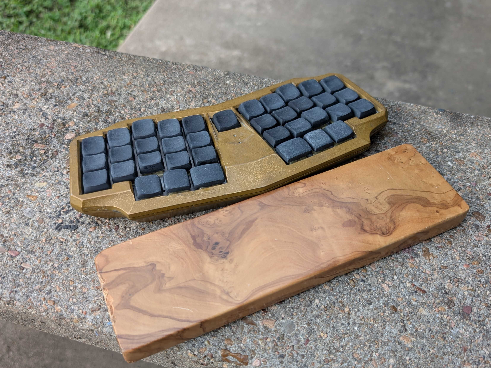
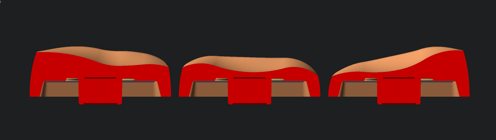
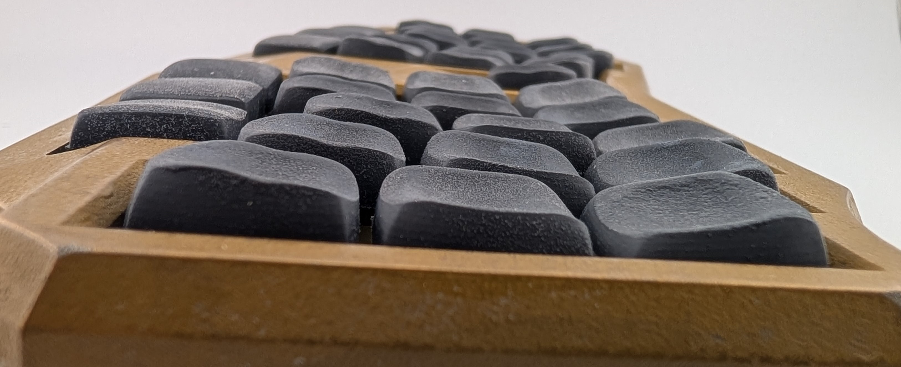

# Subliminal Contradiction
Low Profile Sculpted Keycaps

## Motivation
A proper next iteration on DES that's lower, flatter profile like CS, but as sculpted as DES; Shorter press distance, but wider top surface area; deeper and huggier dish, yet smoother transition between rows, and combo capability

## Specs
	MX Spaced
	MX Stem
	Max height ~6.5mm
	Dish minima ~3.2mm

## ipsum lorem
ipsum lorem

## To Dos
- Choc stem variants
- Modifier sizes for R2-4
